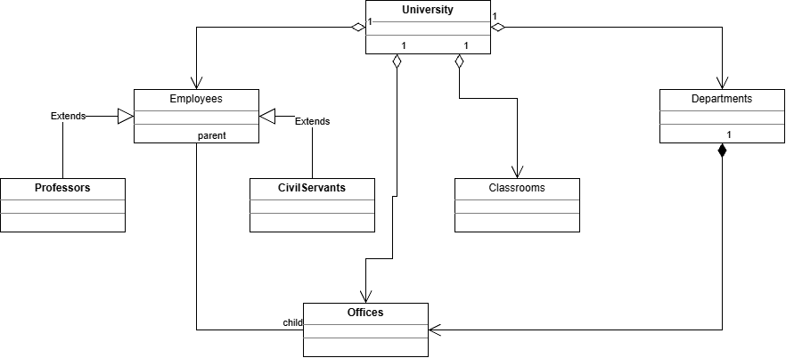

# Object Oriented Programming – UML Assignment

This repository contains my UML class diagram prepared as part of the
Patika.dev Object Oriented Programming course.

## Purpose
The purpose of this assignment is to understand object-oriented design
principles before implementing them in code.

## UML Diagrams

The class diagram is stored in the `uml/` folder as both:
- `class-diagram.drawio` – editable source
- `class-diagram.png` – visual representation

## Notes
- The project currently focuses on design, not implementation.
- Java source code will be added in later stages.
